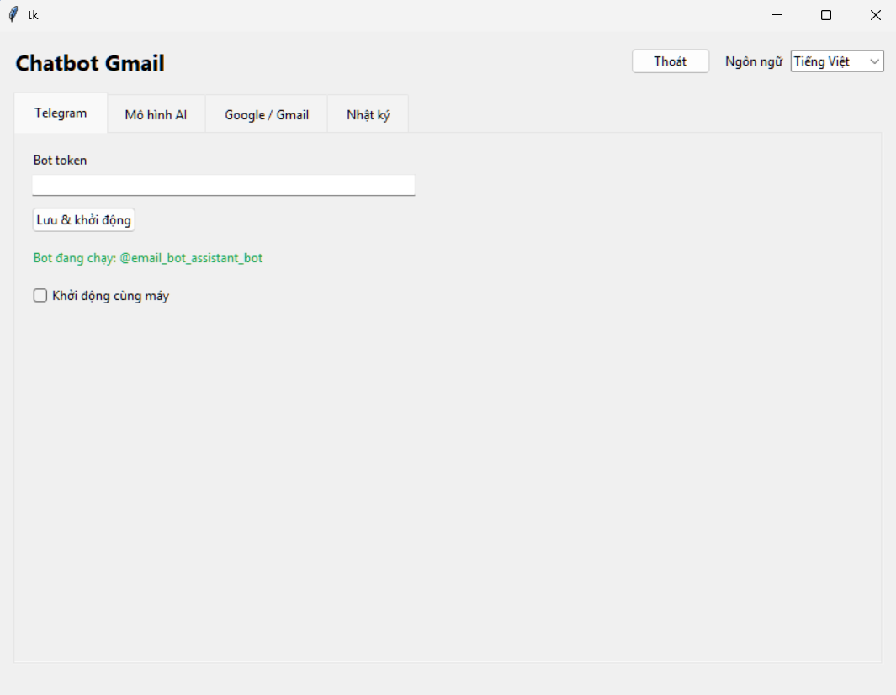
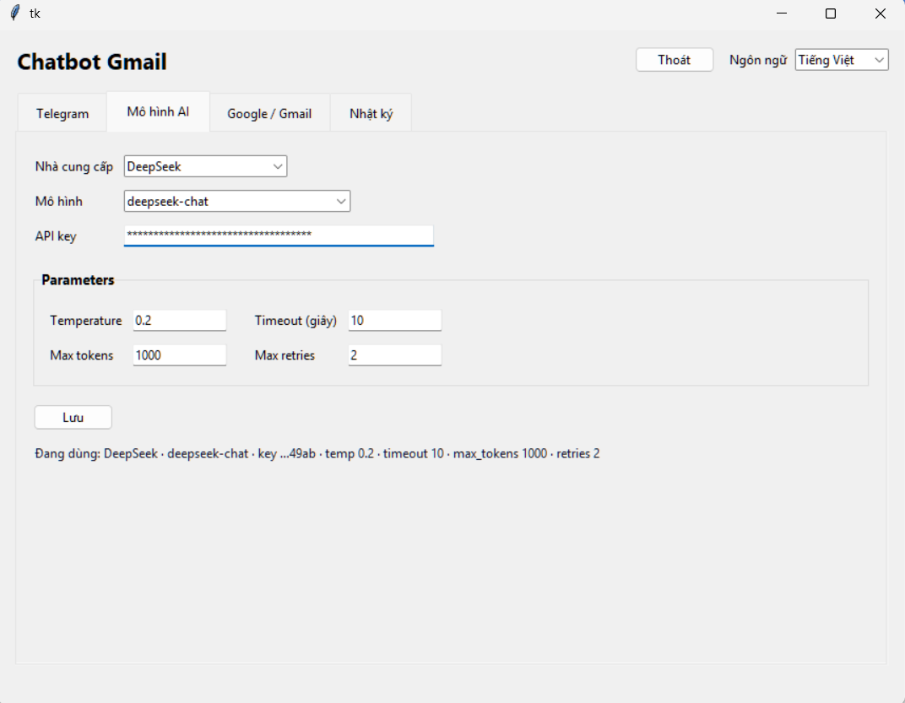

# Chatbot Gmail

A desktop app that runs in the background and turns Telegram into an AI email assistant: search, read and summarize email, draft and send replies (always with confirmation). You configure it once in a native **Settings** window, then interact entirely through Telegram - no hosting, no public URL required.

### How It Works:

The app runs in the background from the system tray. A background thread long-polls Telegram for messages; when one arrives, the AI agent (LangGraph + tool-calling, calling your selected model provider's API) picks the right tool to search/read email through the Gmail API. Sending is not immediate: the agent composes the message, creates a draft in Gmail, and waits for you to press the confirm button in Telegram. The Settings window uses Tkinter. All data is stored locally in SQLite.

### Features:

- **Telegram email assistant** — natural Q&A without opening a browser.
- **Multiple Gmail accounts** — add several accounts, assign labels, pick a default.
- **Safe sending (human-in-the-loop)** — creates a Gmail draft, only sends after you confirm.
- **4 model providers** — OpenAI, DeepSeek, Claude (Anthropic), Gemini (Google), with tunable parameters (temperature, timeout, max_tokens, max_retries).
- **Short-term memory** per conversation; clear it with `/reset`.
- **Primary inbox focus** — searches the Primary tab by default (skips Social/Promotions/Updates) unless you say otherwise.
- **Background tray app** with an optional start-with-system setting.
- **File logging** (daily rotation, kept for 30 days) plus a Logs tab to filter by level.
- **Bilingual UI** English / Vietnamese.
- **Local-first security** — secrets are Fernet-encrypted and stay on your machine.

### Usage:

- Download and unzip the latest release (keeping the accompanying folder is recommended), then run the app.
- The **Settings** window opens; configure it step by step:
  1. **Telegram** — create a bot with [@BotFather](https://t.me/BotFather), paste the token, and click *Save & start*. Enable *Start with system* if you want.
  2. **AI model** — pick a provider (OpenAI / DeepSeek / Claude / Gemini), a model, paste your API key, and adjust the parameters.
  3. **Google / Gmail** — paste the contents of `client_secret.json` (OAuth client type **Desktop app**). See **Notes** for how to create and publish it.
  4. **Gmail accounts** — click **Add account** and sign in with Google in your browser. Repeat to add more accounts; set labels and a default account.
- Close the window to minimize to the tray; click the tray icon to reopen it.
- Open Telegram and chat with the bot, e.g. *"Summarize my latest emails"*, *"Any unpaid invoices?"*, *"Draft a reply to my boss's email"*.
- Bot commands: `/start`, `/setup`, `/status`, `/accounts`, `/language`, `/reset`.

### Pictures:




### Notes:

> [!WARNING]
> The OAuth app must be in the **In production** state (in Google Cloud Console, click **Publish app**). While it stays in *Testing*, the refresh token **expires after 7 days** and you will have to reconnect.

> [!CAUTION]
> `data/secret.key` is the key that decrypts every secret in `data/app.db` (bot token, LLM API key, client secret, Gmail refresh tokens). Keep this file safe and backed up; if it is lost or changed, the encrypted data can **no longer be decrypted**.

> [!IMPORTANT]
> The bot is only online while the app is running. When your machine is off, the bot stays silent; messages sent within ~24 hours will be processed once you start the app again.

> [!NOTE]
> The *Add account* button opens your **default browser** (Google blocks OAuth inside webviews). Finish signing in, then come back to the app.

> [!NOTE]
> On Linux/WSL you need Tkinter: `sudo apt install python3-tk` (bundled on Windows/macOS). Windows 11 ships WSLg, so the GUI window can be displayed.

<!-- > [!NOTE]
> An `OpenAIConnectionError: Connection error` while chatting is usually caused by the `brotli` package in the environment breaking decoding in `httpx2` (the HTTP library used by `openai`). Fix it with `pip uninstall -y brotli brotlicffi` — commonly seen when running from a **conda base**, so prefer a dedicated venv. -->

### Notes about the Windows build:

- Packaged with **PyInstaller** (onedir), together with an **Inno Setup** script to build an installer.
- Some antivirus engines (including Windows Defender) may flag the `.exe` as malicious because PyInstaller has been abused in the past; these reports can be ignored. If you don't trust it, run directly from source.
- Use a **dedicated venv**; `pip` and `PyInstaller` must use the **same Python** (do not use a conda base). The spec fails loudly if a package is missing.
- PyInstaller **cannot cross-compile** — the Windows build must run on Windows.
- Build from a regular drive path (avoid UNC paths like `\\wsl.localhost\...`).

```powershell
powershell -ExecutionPolicy Bypass -File packaging\build_windows.ps1
# -> dist\ChatbotGmail\ChatbotGmail.exe   (onedir)
# (optional) build the installer: iscc packaging\windows\installer.iss
```

Running directly from source:

```bash
python -m venv venv
venv/bin/pip install -r requirements.txt   # Windows: venv\Scripts\pip
python -m app
```

### Notes about the Linux/WSL build:

- Running from source needs Python 3.12 + Tkinter (`python3-tk`) and a display (WSLg on Windows 11).
- The system tray (`pystray`) is **disabled on Linux** by default; in that case closing the Settings window exits the app. You can enable it with the `CHATBOT_GMAIL_TRAY=1` environment variable.
- The Linux build uses the same PyInstaller spec but must be built on Linux itself (no cross-compilation).

### Project Structure:

```
ChatbotGmail/
├── app/                        # application source
│   ├── __main__.py             # entry point: `python -m app`
│   ├── core/                   # shared foundations
│   │   ├── config.py           # environment + path configuration
│   │   ├── paths.py            # data/logs locations, secret key, bundled resource path
│   │   ├── storage.py          # SQLite (SQLAlchemy) + Fernet encryption + migration
│   │   ├── i18n.py             # vi/en strings for the bot
│   │   └── observability/      # file logging, AppError, event_ref
│   ├── auth/oauth.py           # Google OAuth: consent URL + loopback callback server
│   ├── email/gmail_client.py   # Gmail API: search/read/send/draft/profile (multi-account)
│   ├── agent/                  # the AI "brain"
│   │   ├── llm.py              # init_chat_model for the 4 providers (lazy import)
│   │   ├── tools.py            # Gmail tools exposed to the agent
│   │   └── graph.py            # agent loop (LangGraph) + short-term memory
│   ├── telegram/               # Telegram bot
│   │   ├── manager.py          # start/stop/restart the bot
│   │   └── handlers.py         # commands, chat handling, send-confirmation buttons
│   └── desktop/                # desktop UI
│       ├── app.py              # app lifecycle: single-instance, tray, GUI
│       ├── gui.py              # Settings window (Tkinter/ttk)
│       ├── runtime.py          # runs the bot on a background thread
│       ├── tray.py             # system tray icon
│       └── autostart.py        # start with system (Win/mac/Linux)
├── packaging/                  # PyInstaller spec + Inno Setup + entry point
├── assets/                     # icon and README images
├── data/                       # (created at runtime) app.db, secret.key, app.lock
├── logs/                       # (created at runtime) app.log, error.log (kept 30 days)
├── requirements.txt
└── README.md
```

**Data location:** `data/` and `logs/` live **alongside `app/` and `assets/`** (inside the repo when developing; next to `ChatbotGmail.exe` when packaged). Override with the `CHATBOT_DATA_DIR` environment variable.
